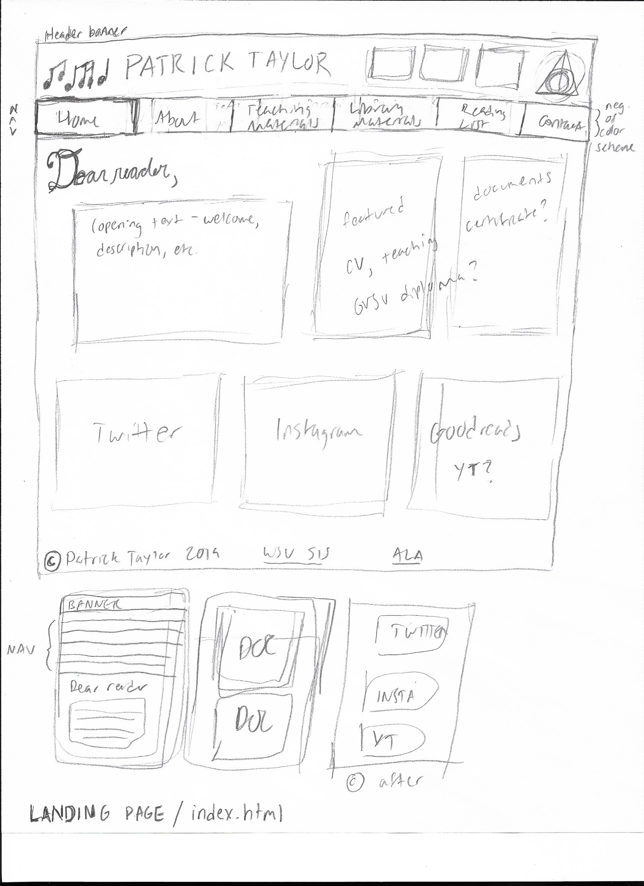
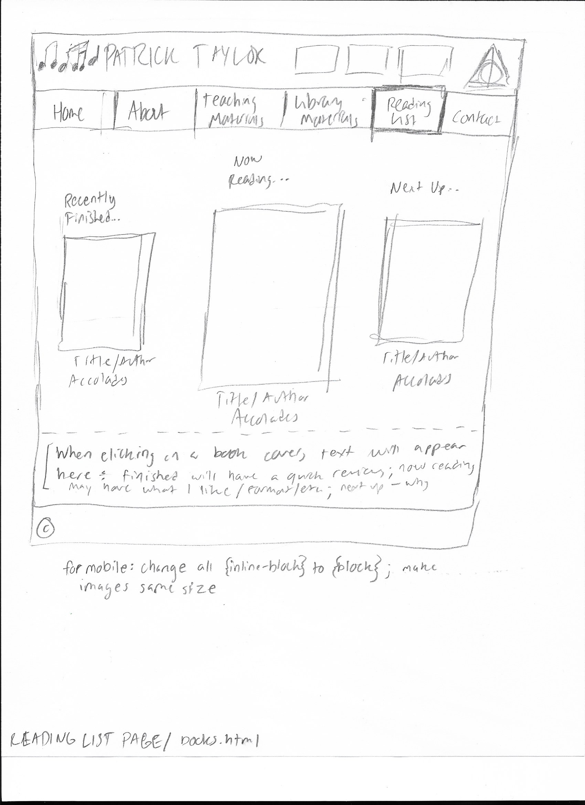
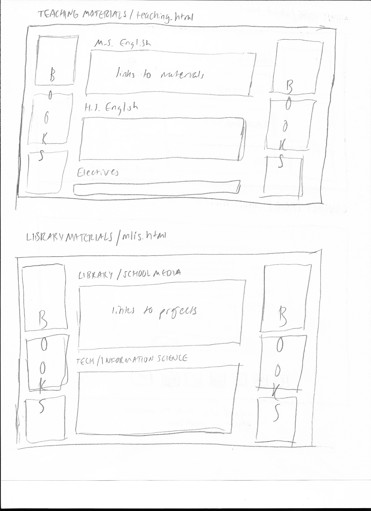
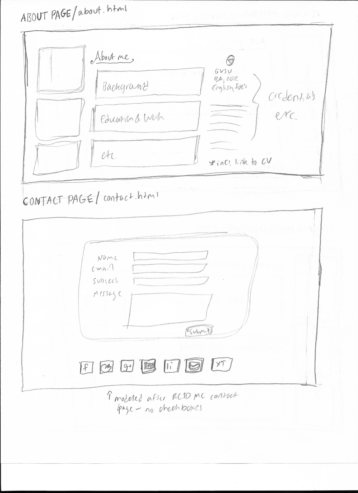

# My Portfolio Website

Moving forward using my skills acquired from INF 7420, I am going to create a portfolio website to showcase my MLIS work. I will include work from SIS courses as well as work that I do in my teaching career that I find relevant.

## Wireframes

The landing page will have a banner header, navigation menu, welcome message, some featured documents/images, feeds from social media, and a footer with copyright.

The Reading List Page will have the same header/footer, but the body will have 3 blocked images of book covers--just finished, currently reading next up--and will eventually have some Javascript/animation incorporated to give the reader more information. For example, a review for just finished, an impression for currently reading, and a why-I'm-interested for next up. 

These pages will be set up similarly with the same header and footer, but the space on the sides will have a few book covers as decoration for the page. The body will include links to teaching materials, unit and lesson plans, and links to projects from my MLIS coursework.

These two pages will have the same header and footer as the previous pages. On the About page, there will be some images of me, a brief biography, and my credentials. On the contact page, there will be a contact form smiliar to that on the RCSD Media Centers contact page, but without a phone number space and no checkboxes.