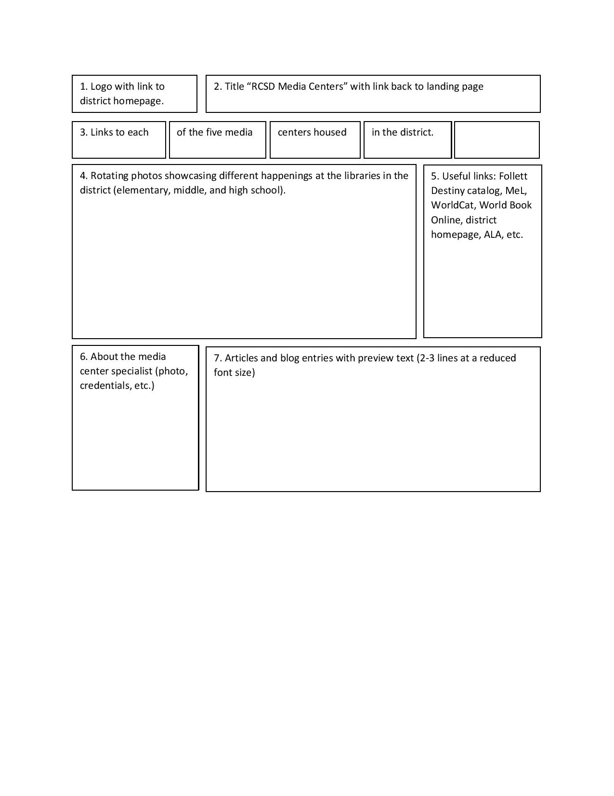
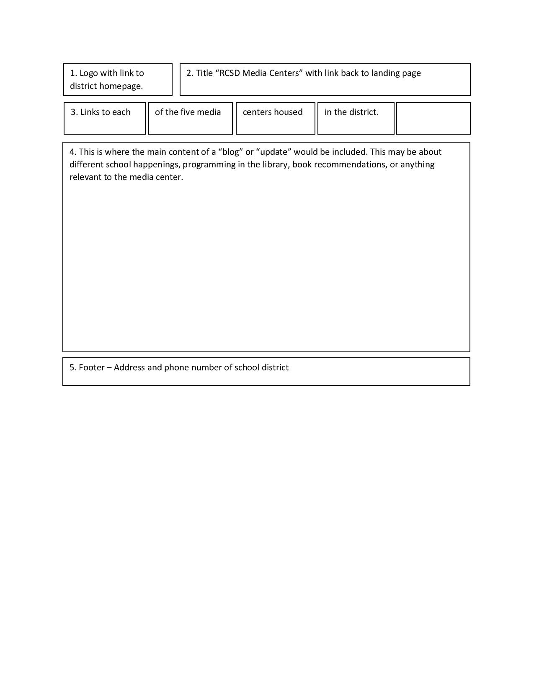
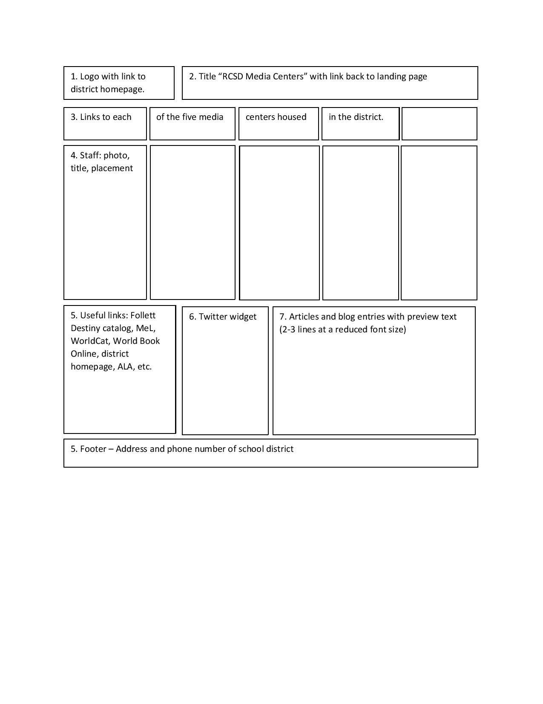

# My INF7420 Project

I am going to build a website for my school district's media centers. I was recently hired in Riverview and I want to create a website to showcase the work and programming the media centers are doing to serve our school district.

## Wireframes

Here are my general, envisioned wireframes that show how I plan to lay the website out.

Header - will include the school district logo and the name of the website

Navigation - will be a row of boxes linking to each school's media center

Main Coontent - rotating photos of school happenings, useful links

About - brief bio/summary of credentials about the media center specialist

Footer - school district address, phone number, contact info

Header - will include the school district logo and the name of the website

Navigation - will be a row of boxes linking to each school's media center

Main Content - articles and media about the school district, community, and libraries

Footer - school district address, phone number, contact info

Header - district logo and title of website

Navigation - links to each of the five libraries in district

Main Content - photo, title, and placement of each library staff member - in addition to the media specialist, there are four library paraprofessionals throughout the district

Footer - school district address, phone number, contact info